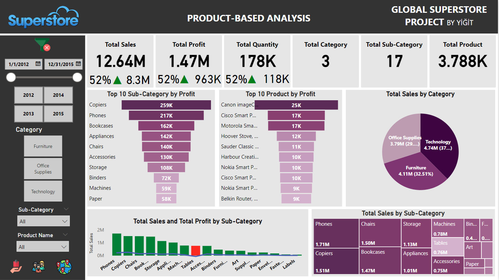
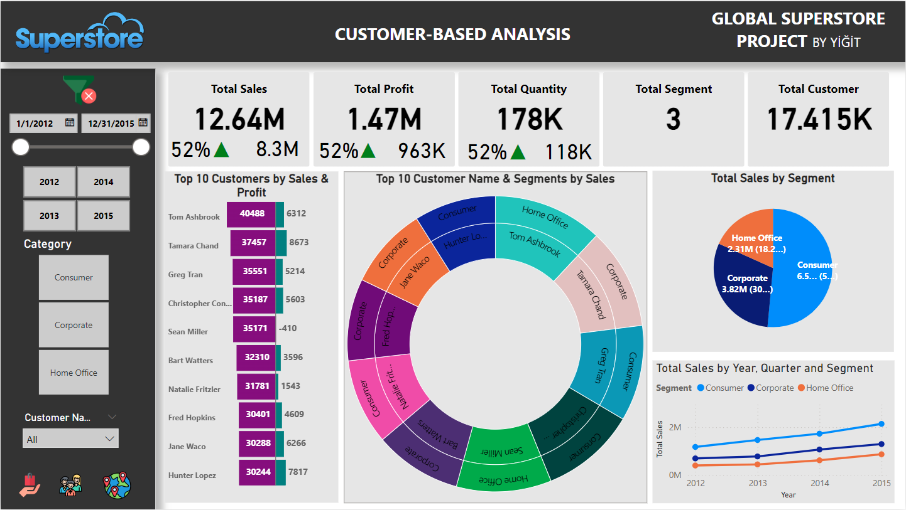
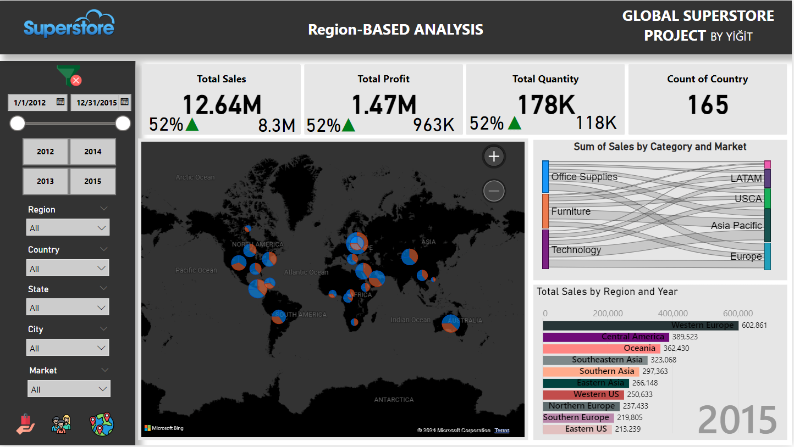

# Global-Superstore-PowerBI-Dashboard

This report provides a general overview of Global Superstore's sales, profitability, and customer performance. The report includes product-based, customer-based, and region-based analyses.

## Project Overview 🎯

This Power BI report offers an in-depth analysis of the **Global Superstore** dataset, covering three key areas:
- **Product-Based Analysis**
- **Customer-Based Analysis**
- **Region-Based Analysis**

The report is designed to provide insights into sales performance, profit margins, and customer behavior, while allowing for drillthrough, tooltip pages, and interactive slicers.

---

## Key Features ✨

### 1. Product-Based Analysis 📊
- **Funnel Chart**: Top 10 products and sub-categories by profit
- **Pie Chart**: Sales distribution by category
- **Treemap**: Sales distribution by sub-category
- **Line Chart**: Sales vs. profit comparison
- **Dynamic cards**: Year-over-year comparisons of Total Sales, Profit, and Quantity

### 2. Customer-Based Analysis 👥
- **Tornado Chart**: Top 10 customers by Sales and Profit
- **Sunburst Chart**: Spending breakdown by segment and customer
- **Yearly segment sales trend**: Analyze how sales evolve across different segments over time

### 3. Region-Based Analysis 🌍
- **Map Visual**: Sales by region and category
- **Sankey Chart**: Relationship between markets and categories
- **Animated Bar Chart Race**: Total sales trends across regions and years

---

## Drillthrough & Tooltip Pages 🔍
- **Drillthrough**: Explore total profit by category using a line chart, with detailed breakdowns by year, quarter, month, and day.
- **Tooltip**: Highlights top-selling products by region.

---
